# Open3DVQA: A Benchmark for Embodied Spatial Concept Reasoning with Multimodal Large Language Model in Open Space

Open3DVQA is a benchamrk to comprehensively evaluate the spatial reasoning capacities of current SOTA foundation models in open 3D space. It consists of 89k VOA samples, collected using aneffcient semi-automated tool in a high-fdelity urban simulator.

## Open3DVQA Benchmark

We present Open3DVQA, a novel benchmark for evaluating MLLMs' ability to reason about complex spatial relationships from an aerial perspective. The benchmark comprises **89k** QA pairs spanning **7** general spatial reasoning tasks—multiple-choice, true/false, and short-answer formats—and supports both visual and point cloud modalities. The questions are automatically generated from spatial relations extracted from both real-world and simulated aerial scenes.

**Note 1:** We propose **Open3DVQA**, a novel question-answering benchmark designed for spatial reasoning in 3D urban environments. The benchmark encompasses four distinct spatial perspectives and **7** task types, providing a comprehensive evaluation of an embodied agent’s 3D spatial reasoning capabilities.

**Note 2:** We introduce a scalable **QA generation pipeline** that extracts 3D spatial relationships and generates diverse QA formats from a single RGB image. We design a plug-and-play multi-modal correction flow that leverages available ground-truth information across modalities to reduce error accumulation and ensure high-quality QAs.

**Note 3:** We evaluate mainstream MLLMs on Open3DVQA, revealing their current limitations in spatial reasoning and analyzing their sim-to-real capacities.

### QA Templates

<table>
  <tr>
    <th style="text-align: center; vertical-align: middle;">QA Tasks</th>
    <th style="text-align: center; vertical-align: middle;">Intention</th>
    <th style="text-align: center; vertical-align: middle;">Examples</th>
  </tr>
  <tr>
    <td align="center"><strong>Allocentric Size Reasoning</strong></td>
    <td style="text-align: center; vertical-align: middle;">
      To infer relative size relationships <strong>between two objects in space</strong>, such as longer/shorter, wider/narrower, taller/shorter, larger/smaller.
    </td>
    <td>
      <table>
        <tr>
          <td>
            <strong>Question:</strong> Does the red storefront with chinese<br>text have a lesser height compared<br>to the white building with blue stripes?<br>
            <strong>Answer:</strong> Yes, the red storefront with chinese<br>text is shorter than the white<br>building with blue stripes.
          </td>
          <td style="width: 90px;"></td>
        </tr>
        <tr>
          <td>
            <strong>Question:</strong> Does the red storefront with chinese<br>text have a lesser height compared<br>to the white building with blue stripes?<br>
            <strong>Answer:</strong> Yes, the red storefront with chinese<br>text is shorter than the white<br>building with blue stripes.
          </td>
          <td style="width: 90px;"></td>
        </tr>
      </table>
    </td>
  </tr>

  <tr>
    <td align="center"><strong>Allocentric Distance Reasoning</strong></td>
    <td style="text-align: center; vertical-align: middle;">
      To infer straight-line, vertical or horizontal <strong>distances between objects</strong>.
    </td>
    <td>
      <table>
        <tr>
          <td>
            <strong>Question:</strong> Does the red storefront with chinese<br>text have a lesser height compared<br>to the white building with blue stripes?<br>
            <strong>Answer:</strong> Yes, the red storefront with chinese<br>text is shorter than the white<br>building with blue stripes.
          </td>
          <td style="width: 90px;"></td>
        </tr>
        <tr>
          <td>
            <strong>Question:</strong> Does the red storefront with chinese<br>text have a lesser height compared<br>to the white building with blue stripes?<br>
            <strong>Answer:</strong> Yes, the red storefront with chinese<br>text is shorter than the white<br>building with blue stripes.
          </td>
          <td style="width: 90px;"></td>
        </tr>
      </table>
    </td>
  </tr>

  <tr>
    <td align="center"><strong>Egocentric Direction Reasoning</strong></td>
    <td style="text-align: center; vertical-align: middle;">
      To infer the direction of an object <strong>relative to the agent</strong>, such as left, right, up and down.
    </td>
    <td>
      <table>
        <tr>
          <td>
            <strong>Question:</strong> Does the red storefront with chinese<br>text have a lesser height compared<br>to the white building with blue stripes?<br>
            <strong>Answer:</strong> Yes, the red storefront with chinese<br>text is shorter than the white<br>building with blue stripes.
          </td>
          <td style="width: 90px;"></td>
        </tr>
        <tr>
          <td>
            <strong>Question:</strong> Does the red storefront with chinese<br>text have a lesser height compared<br>to the white building with blue stripes?<br>
            <strong>Answer:</strong> Yes, the red storefront with chinese<br>text is shorter than the white<br>building with blue stripes.
          </td>
          <td style="width: 90px;"></td>
        </tr>
      </table>
    </td>
  </tr>

  <tr>
    <td align="center"><strong>Egocentric Distance Reasoning</strong></td>
    <td style="text-align: center; vertical-align: middle;">
      To infer the straight-line distance of an object <strong>from the agent</strong>.
    </td>
    <td>
      <table>
        <tr>
          <td>
            <strong>Question:</strong> Does the red storefront with chinese<br>text have a lesser height compared<br>to the white building with blue stripes?<br>
            <strong>Answer:</strong> Yes, the red storefront with chinese<br>text is shorter than the white<br>building with blue stripes.
          </td>
          <td style="width: 90px;"></td>
        </tr>
        <tr>
          <td>
            <strong>Question:</strong> Does the red storefront with chinese<br>text have a lesser height compared<br>to the white building with blue stripes?<br>
            <strong>Answer:</strong> Yes, the red storefront with chinese<br>text is shorter than the white<br>building with blue stripes.
          </td>
          <td style="width: 90px;"></td>
        </tr>
      </table>
    </td>
  </tr>

  <tr>
    <td align="center"><strong>Allocentric-Egocentric Transformation Direction Reasoning</strong></td>
    <td style="text-align: center; vertical-align: middle;">
      The agent <strong>infers the direction of objects</strong> relative to itself based on its movement.
    </td>
    <td>
      <table>
        <tr>
          <td>
            <strong>Question:</strong> Does the red storefront with chinese<br>text have a lesser height compared<br>to the white building with blue stripes?<br>
            <strong>Answer:</strong> Yes, the red storefront with chinese<br>text is shorter than the white<br>building with blue stripes.
          </td>
          <td style="width: 90px;"></td>
        </tr>
        <tr>
          <td>
            <strong>Question:</strong> Does the red storefront with chinese<br>text have a lesser height compared<br>to the white building with blue stripes?<br>
            <strong>Answer:</strong> Yes, the red storefront with chinese<br>text is shorter than the white<br>building with blue stripes.
          </td>
          <td style="width: 90px;"></td>
        </tr>
      </table>
    </td>
  </tr>

  <tr>
    <td align="center"><strong>Allocentric-Egocentric Transformation Distance Reasoning</strong></td>
    <td style="text-align: center; vertical-align: middle;">
      The agent <strong>infers object distance</strong> in the horizontal or vertical direction relative to itself.
    </td>
    <td>
      <table>
        <tr>
          <td>
            <strong>Question:</strong> Does the red storefront with chinese<br>text have a lesser height compared<br>to the white building with blue stripes?<br>
            <strong>Answer:</strong> Yes, the red storefront with chinese<br>text is shorter than the white<br>building with blue stripes.
          </td>
          <td style="width: 90px;"></td>
        </tr>
        <tr>
          <td>
            <strong>Question:</strong> Does the red storefront with chinese<br>text have a lesser height compared<br>to the white building with blue stripes?<br>
            <strong>Answer:</strong> Yes, the red storefront with chinese<br>text is shorter than the white<br>building with blue stripes.
          </td>
          <td style="width: 90px;"></td>
        </tr>
      </table>
    </td>
  </tr>

  <tr>
    <td align="center"><strong>Object-Centric Size Reasoning</strong></td>
    <td style="text-align: center; vertical-align: middle;">
      To infer the <strong>absolute size</strong> of a single object, such as its length, width or height.
    </td>
    <td>
      <table>
        <tr>
          <td>
            <strong>Question:</strong> Does the red storefront with chinese<br>text have a lesser height compared<br>to the white building with blue stripes?<br>
            <strong>Answer:</strong> Yes, the red storefront with chinese<br>text is shorter than the white<br>building with blue stripes.
          </td>
          <td style="width: 90px;"></td>
        </tr>
        <tr>
          <td>
            <strong>Question:</strong> Does the red storefront with chinese<br>text have a lesser height compared<br>to the white building with blue stripes?<br>
            <strong>Answer:</strong> Yes, the red storefront with chinese<br>text is shorter than the white<br>building with blue stripes.
          </td>
          <td style="width: 90px;"></td>
        </tr>
      </table>
    </td>
  </tr>
</table>

### Response Examples

<table>
  <tr>
    <th style="text-align: center; vertical-align: middle;">QA Tasks</th>
    <th style="text-align: center; vertical-align: middle;">Questions</th>
    <th style="text-align: center; vertical-align: middle;">Responses</th>
  </tr>
  <tr>
    <td align="center"><strong>Allocentric Size<br>Reasoning</strong></td>
   <td>
      <table>
        <tr>
          <td align="center">
            
          </td>
        </tr>
        <tr>
          <td align="left">
            Does the red storefront with Chinese<br>
            text have a lesser height compared<br>
            to the white building with blue stripes?
          </td>
        </tr>
      </table>
   </td>
    <td>
      <strong>Gemini-2.5-Flash:</strong> Yes, the red storefront with chinese text is shorter than the white building with blue stripes.<br>
      <strong>Qwen2-VL-Finetuned:</strong> Yes, the red storefront with chinese text is shorter than the white building with blue stripes.<br>
      <strong>3D-LLM:</strong> Yes, the red storefront with chinese text is shorter than the white building with blue stripes.
    </td>
  </tr>

  <tr>
    <td align="center"><strong>Allocentric Distance<br>Reasoning</strong></td>
   <td>
      <table>
        <tr>
          <td align="center">
            
          </td>
        </tr>
        <tr>
          <td align="left">
            Does the red storefront with Chinese<br>
            text have a lesser height compared<br>
            to the white building with blue stripes?
          </td>
        </tr>
      </table>
   </td>
    <td>
      <strong>Gemini-2.5-Flash:</strong> Yes, the red storefront with chinese text is shorter than the white building with blue stripes.<br>
      <strong>Qwen2-VL-Finetuned:</strong> Yes, the red storefront with chinese text is shorter than the white building with blue stripes.<br>
      <strong>3D-LLM:</strong> Yes, the red storefront with chinese text is shorter than the white building with blue stripes.
    </td>
  </tr>

  <tr>
    <td align="center"><strong>Egocentric Direction<br>Reasoning</strong></td>
   <td>
      <table>
        <tr>
          <td align="center">
            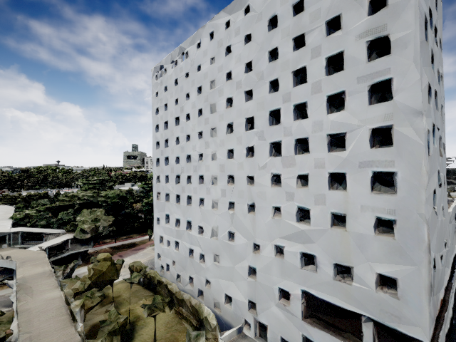
          </td>
        </tr>
        <tr>
          <td align="left">
            Does the red storefront with Chinese<br>
            text have a lesser height compared<br>
            to the white building with blue stripes?
          </td>
        </tr>
      </table>
   </td>
    <td>
      <strong>Gemini-2.5-Flash:</strong> Yes, the red storefront with chinese text is shorter than the white building with blue stripes.<br>
      <strong>Qwen2-VL-Finetuned:</strong> Yes, the red storefront with chinese text is shorter than the white building with blue stripes.<br>
      <strong>3D-LLM:</strong> Yes, the red storefront with chinese text is shorter than the white building with blue stripes.
    </td>
  </tr>

  <tr>
    <td align="center"><strong>Egocentric Distance<br>Reasoning</strong></td>
   <td>
      <table>
        <tr>
          <td align="center">
            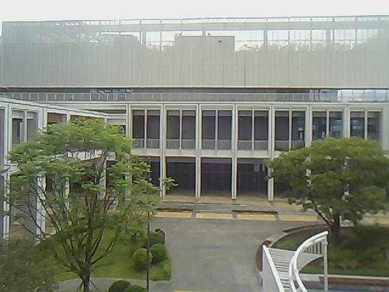
          </td>
        </tr>
        <tr>
          <td align="left">
            Does the red storefront with Chinese<br>
            text have a lesser height compared<br>
            to the white building with blue stripes?
          </td>
        </tr>
      </table>
   </td>
    <td>
      <strong>Gemini-2.5-Flash:</strong> Yes, the red storefront with chinese text is shorter than the white building with blue stripes.<br>
      <strong>Qwen2-VL-Finetuned:</strong> Yes, the red storefront with chinese text is shorter than the white building with blue stripes.<br>
      <strong>3D-LLM:</strong> Yes, the red storefront with chinese text is shorter than the white building with blue stripes.
    </td>
  </tr>

  <tr>
    <td align="center"><strong>Allocentric-Egocentric<br>Transformation Direction<br>Reasoning</strong></td>
   <td>
      <table>
        <tr>
          <td align="center">
            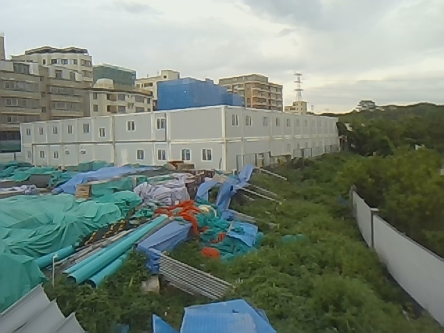
          </td>
        </tr>
        <tr>
          <td align="left">
            Does the red storefront with Chinese<br>
            text have a lesser height compared<br>
            to the white building with blue stripes?
          </td>
        </tr>
      </table>
   </td>
    <td>
      <strong>Gemini-2.5-Flash:</strong> Yes, the red storefront with chinese text is shorter than the white building with blue stripes.<br>
      <strong>Qwen2-VL-Finetuned:</strong> Yes, the red storefront with chinese text is shorter than the white building with blue stripes.<br>
      <strong>3D-LLM:</strong> Yes, the red storefront with chinese text is shorter than the white building with blue stripes.
    </td>
  </tr>

  <tr>
    <td align="center"><strong>Allocentric-Egocentric<br>Transformation Distance<br>Reasoning</strong></td>
   <td>
      <table>
        <tr>
          <td align="center">
            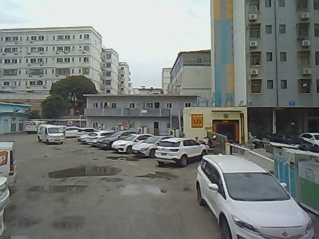
          </td>
        </tr>
        <tr>
          <td align="left">
            Does the red storefront with Chinese<br>
            text have a lesser height compared<br>
            to the white building with blue stripes?
          </td>
        </tr>
      </table>
   </td>
    <td>
      <strong>Gemini-2.5-Flash:</strong> Yes, the red storefront with chinese text is shorter than the white building with blue stripes.<br>
      <strong>Qwen2-VL-Finetuned:</strong> Yes, the red storefront with chinese text is shorter than the white building with blue stripes.<br>
      <strong>3D-LLM:</strong> Yes, the red storefront with chinese text is shorter than the white building with blue stripes.
    </td>
  </tr>

  <tr>
    <td align="center"><strong>Object-Centric<br>Size Reasoning</strong></td>
   <td>
      <table>
        <tr>
          <td align="center">
            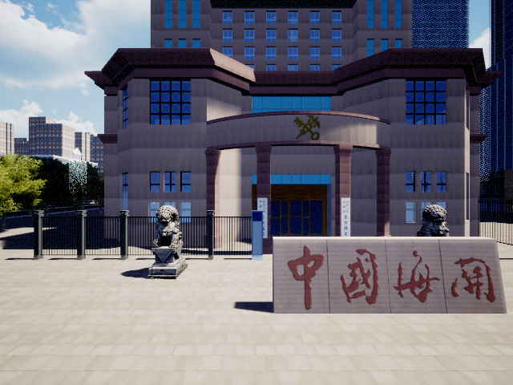
          </td>
        </tr>
        <tr>
          <td align="left">
            Does the red storefront with Chinese<br>
            text have a lesser height compared<br>
            to the white building with blue stripes?
          </td>
        </tr>
      </table>
   </td>
    <td>
      <strong>Gemini-2.5-Flash:</strong> Yes, the red storefront with chinese text is shorter than the white building with blue stripes.<br>
      <strong>Qwen2-VL-Finetuned:</strong> Yes, the red storefront with chinese text is shorter than the white building with blue stripes.<br>
      <strong>3D-LLM:</strong> Yes, the red storefront with chinese text is shorter than the white building with blue stripes.
    </td>
  </tr>
</table>

### Multiple Modalities

| Sample             | RGB                                                       | Depth                     |Caption & Bounding Box                                                     | Mask                                                      | PointCloud                                                |
|:------------:|:---------------------------------------------------------:|:---------------------------------------------------------:|:---------------------------------------------------------:|:---------------------------------------------------------:|:----------------------------------------------------------:|
| **1** |                 |               | 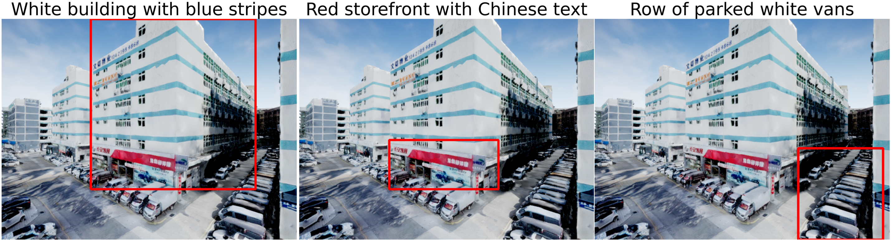              |               | 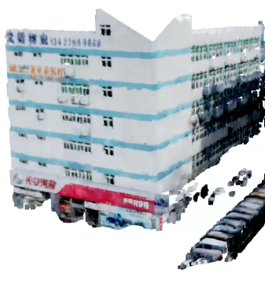                |
| **2** |                 |               | 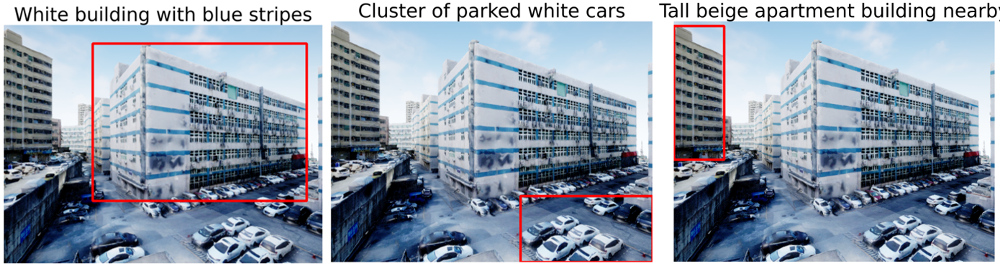              |               | 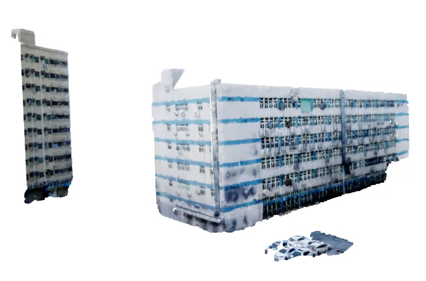                |
| **3** |                 | 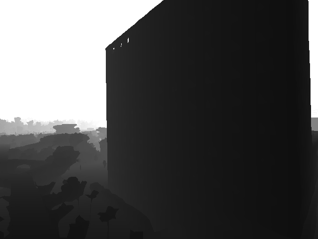              |               |               | 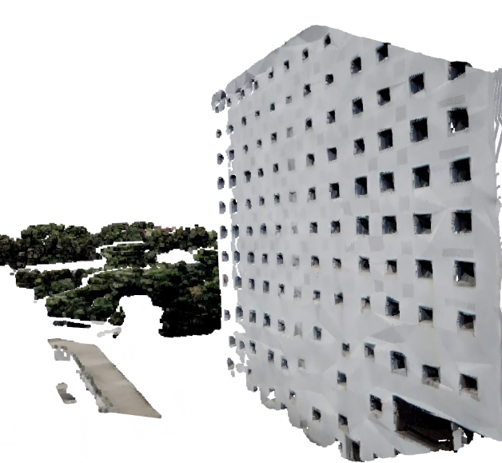                |
| **4** |                 |               | 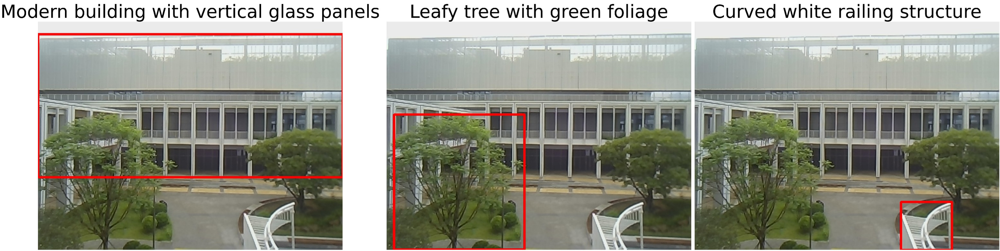              |               | 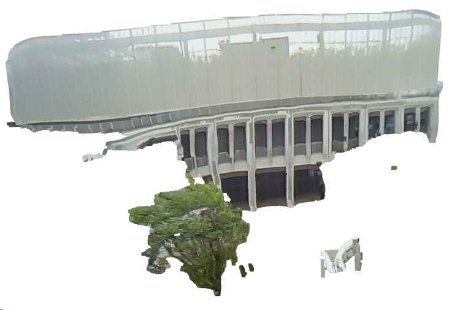                |
| **5** |                 |               | 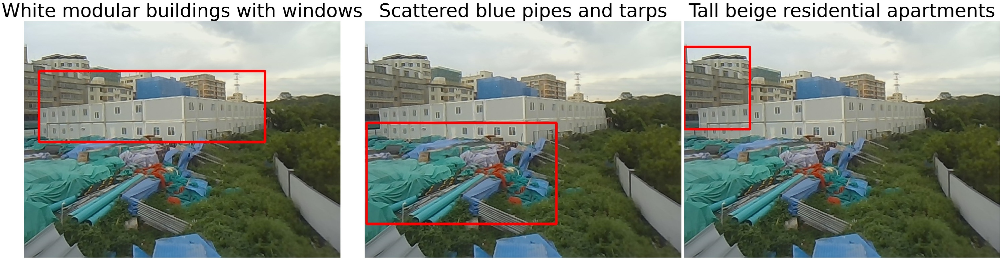              |               | 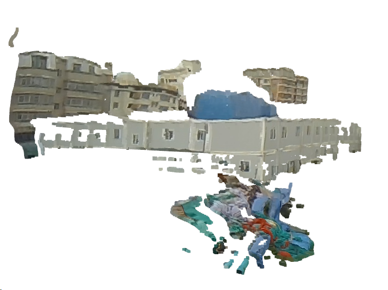                |
| **6** |                 |               | 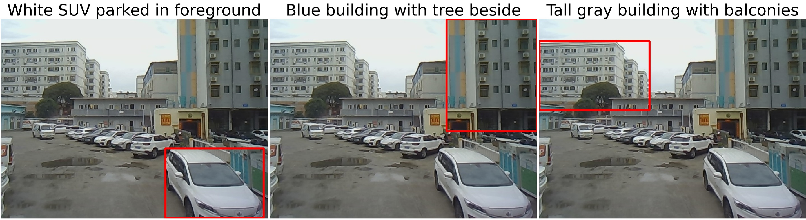              |               |                 |


## QA Generation Pipeline

We've also made the dataset synthesis pipeline available. You can find the code and instructions in the [processor](processor) folder.

Please clone this repository and change path to the floder. Then use the following command to get the open3dvqa dataset.
```bash
   cd Open3DVQA
```
Place your own boundingbox.json path extracted from Airsim and change your boundingbox.json path in the id_processor.py. The structure should be as follow:
```
Open3DVQA/
├── utils/
├── processor/
│   ├── id_processor.py
│   ├── caption_processor.py
│   ├── ...
├── data/
│   ├── open3dvqa/
│   │   ├── 1/
│   │   │   ├── depth/
│   │   │   ├── state/
│   │   │   ├── rgb/
│   │   │   ├── visible_objs/
│   │   ├── ...
│   ├── object_info.json
│   ├── Buildingbbox.json
│   ├── ...
```
Run id_processor.py to get ids of interested objects. After that, run caption_processor.py to get the boundingbox and egocentric coordinates. Fill your own gpt api key in the gpt4_caption.py and run the create_vqa.sh to get your own dataset.

```bash
   python processor/id_processor.py
   python processor/caption_processor.py
   bash processor/create_vqa.sh
```

Feel free to report any issues or unexpected results you encounter.

## Inference & Evaluation

We've also made the dataset synthesis pipeline available. You can find the code and instructions in the [processor](processor) folder.

Please clone this repository and change path to the floder. Then use the following command to get the open3dvqa dataset.
```bash
   cd Open3DVQA
```
Place your own boundingbox.json path extracted from Airsim and change your boundingbox.json path in the id_processor.py. The structure should be as follow:
```
Open3DVQA/
├── utils/
├── processor/
│   ├── id_processor.py
│   ├── caption_processor.py
│   ├── ...
├── data/
│   ├── open3dvqa/
│   │   ├── 1/
│   │   │   ├── depth/
│   │   │   ├── state/
│   │   │   ├── rgb/
│   │   │   ├── visible_objs/
│   │   ├── ...
│   ├── object_info.json
│   ├── Buildingbbox.json
│   ├── ...
```
Run id_processor.py to get ids of interested objects. After that, run caption_processor.py to get the boundingbox and egocentric coordinates. Fill your own gpt api key in the gpt4_caption.py and run the create_vqa.sh to get your own dataset.

```bash
   python processor/id_processor.py
   python processor/caption_processor.py
   bash processor/create_vqa.sh
```

Feel free to report any issues or unexpected results you encounter.

## Acknowledgement

We have used code snippets from different repositories, especially from: LLaVA, Qwen2-VL and VQASynth. We would like to acknowledge and thank the authors of these repositories for their excellent work.
