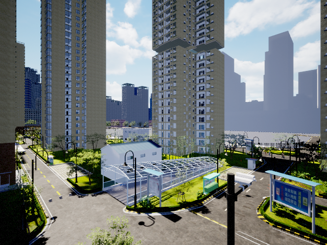
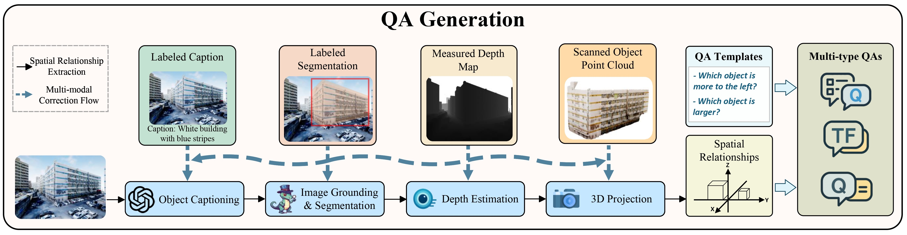

# Open3DVQA: A Benchmark for Embodied Spatial Concept Reasoning with Multimodal Large Language Model in Open Space

[](CODE_LICENSE)
[](CODE_LICENSE)
[](https://www.python.org/downloads/release/python-3100/)

______________________________________________________________________

[**📄 Open3DVQA: A Benchmark for Comprehensive Spatial Reasoning with Multimodal Large Language Model in Open Space**](<https://www.arxiv.org/abs/2503.11094>)

We present Open3DVQA, a novel benchmark for evaluating MLLMs' ability to reason about complex spatial relationships from an aerial perspective.The QAs are automatically generated from spatial relations extracted from both real-world and simulated aerial scenes.


______________________________________________________________________

## 📢 News
- **June-03-2025**- Open3DVQA v2 is released at [Open3DVQA-v2](https://github.com/WeichenZh/Open3DVQA/tree/o3dvqa_v2)! 🔥
- **Mar-15-2025**- Open3DVQA preprint released at [Arxiv](https://www.arxiv.org/abs/2503.11094)! 🔥
- **Feb-27-2025**- Open3DVQA code/dataset released! 🔥
______________________________________________________________________

## ✅ Open3DVQA Benchmark

Open3DVQA is a novel benchmark evaluating MLLMs' ability to reason about complex spatial relationships from an aerial view. It contains **89k** QA pairs across **7** spatial reasoning tasks—including multiple-choice, true/false, and short-answer formats—and supports both visual and point cloud data. Questions are automatically generated from spatial relations in real-world and simulated aerial scenes.

**💡 Key highlights:**

- Covers four spatial perspectives and **7** task types for comprehensive open 3D spatial reasoning evaluation.
- Introduces a scalable **QA generation pipeline** that extracts 3D spatial relationships and creates diverse QA formats from a single RGB image, with a multi-modal correction flow to ensure quality.
- Benchmarks mainstream MLLMs, revealing their current spatial reasoning limitations and sim-to-real generalization capabilities.

### 📋 QA Templates

<table>
  <tr>
    <th style="text-align: center; vertical-align: middle;">QA Tasks</th>
    <th style="text-align: center; vertical-align: middle;">Intention</th>
    <th style="text-align: center; vertical-align: middle;">Examples</th>
  </tr>
  <tr>
    <td align="center"><strong>Allocentric Size Reasoning</strong></td>
    <td style="text-align: center; vertical-align: middle;">
      To infer relative size relationships <strong>between two objects in space</strong>, such as longer/shorter, wider/narrower, taller/shorter, larger/smaller.
    </td>
    <td>
      <table>
        <tr>
          <td width="360px">
            <strong>Question:</strong> Is the modern building with vertical glass panels thinner than the curved white railing structure?<br>
            <strong>Answer:</strong> No, the modern building with vertical glass panels is not thinner than the curved white railing structure.
          </td>
          <td style="width: 90px;"></td>
        </tr>
        <tr>
          <td width="360px">
            <strong>Question:</strong> Which of these two, the white modular buildings with windows or the tall beige residential apartments, appears wider?<br>
            <strong>Answer:</strong> Appearing wider between the two is white modular buildings with windows.
          </td>
          <td style="width: 90px;"></td>
        </tr>
      </table>
    </td>
  </tr>

  <tr>
    <td align="center"><strong>Allocentric Distance Reasoning</strong></td>
    <td style="text-align: center; vertical-align: middle;">
      To infer straight-line, vertical or horizontal <strong>distances between objects</strong>.
    </td>
    <td>
      <table>
        <tr>
          <td width="360px">
            <strong>Question:</strong> How close is the white building with small square windows from the grey pathway leading to the building?<br>
            <strong>Answer:</strong> A distance of 32.15 meters exists between the white building with small square windows and the grey pathway leading to the building.
          </td>
          <td style="width: 90px;"></td>
        </tr>
        <tr>
          <td width="360px">
            <strong>Question:</strong> How far is the row of parked white vans from the white building with blue stripes horizontally?<br>
            <strong>Answer:</strong> The row of parked white vans is 6.26 meters away from the white building with blue stripes horizontally.
          </td>
          <td style="width: 90px;"></td>
        </tr>
      </table>
    </td>
  </tr>

  <tr>
    <td align="center"><strong>Egocentric Direction Reasoning</strong></td>
    <td style="text-align: center; vertical-align: middle;">
      To infer the direction of an object <strong>relative to the agent</strong>, such as left, right, up and down.
    </td>
    <td>
      <table>
        <tr>
          <td width="360px">
            <strong>Question:</strong> Is the white modular buildings with windows to the left of you from the viewer's perspective?<br>
            <strong>Answer:</strong> Yes, the white modular buildings with windows is to the left.
          </td>
          <td style="width: 90px;"></td>
        </tr>
        <tr>
          <td width="360px">
            <strong>Question:</strong> Which is closer to viewer, the white suv parked in foreground or the blue building with tree beside?\nA:white suv parked in foreground\nB:blue building with tree beside\nC:Same\nD:Unknown<br>
            <strong>Answer:</strong> A.white suv parked in foreground.
          </td>
          <td style="width: 90px;"></td>
        </tr>
      </table>
    </td>
  </tr>

  <tr>
    <td align="center"><strong>Egocentric Distance Reasoning</strong></td>
    <td style="text-align: center; vertical-align: middle;">
      To infer the straight-line distance of an object <strong>from the agent</strong>.
    </td>
    <td>
      <table>
        <tr>
          <td width="360px">
            <strong>Question:</strong> How far is the red storefront with chinese text from you?<br>
            <strong>Answer:</strong> 29.0 meters
          </td>
          <td style="width: 90px;"></td>
        </tr>
        <tr>
          <td width="360px">
            <strong>Question:</strong> How close is the white building with blue stripes from you?<br>
            <strong>Answer:</strong> The distance of the white building with blue stripes is 41.73 meters.
          </td>
          <td style="width: 90px;"></td>
        </tr>
      </table>
    </td>
  </tr>

  <tr>
    <td align="center"><strong>Allocentric-Egocentric Transformation Direction Reasoning</strong></td>
    <td style="text-align: center; vertical-align: middle;">
      The agent <strong>infers the direction of objects</strong> relative to itself based on its movement.
    </td>
    <td>
      <table>
        <tr>
          <td width="360px">
            <strong>Question:</strong> If you are at white building with small square windows, where will you find grey pathway leading to the building?<br>
            <strong>Answer:</strong> Grey pathway leading to the building is roughly at 9 o'clock from white building with small square windows.
          </td>
          <td style="width: 90px;"></td>
        </tr>
        <tr>
          <td width="360px">
            <strong>Question:</strong> If you are at row of parked white vans, where will you find white building with blue stripes?<br>
            <strong>Answer:</strong> Row of parked white vans will find white building with blue stripes around the 10 o'clock direction.
          </td>
          <td style="width: 90px;"></td>
        </tr>
      </table>
    </td>
  </tr>

  <tr>
    <td align="center"><strong>Allocentric-Egocentric Transformation Distance Reasoning</strong></td>
    <td style="text-align: center; vertical-align: middle;">
      The agent <strong>infers object distance</strong> in the horizontal or vertical direction relative to itself.
    </td>
    <td>
      <table>
        <tr>
          <td width="360px">
            <strong>Question:</strong> Could you provide the vertical distance between the white building with blue stripes and you?<br>
            <strong>Answer:</strong> 4.19 meters
          </td>
          <td style="width: 90px;"></td>
        </tr>
        <tr>
          <td width="360px">
            <strong>Question:</strong> How distant is the green foliage surrounding the structure from you horizontally?<br>
            <strong>Answer:</strong> Horizontally, 96.91 meters apart.
          </td>
          <td style="width: 90px;"></td>
        </tr>
      </table>
    </td>
  </tr>

  <tr>
    <td align="center"><strong>Object-Centric Size Reasoning</strong></td>
    <td style="text-align: center; vertical-align: middle;">
      To infer the <strong>absolute size</strong> of a single object, such as its length, width or height.
    </td>
    <td>
      <table>
        <tr>
          <td width="360px">
            <strong>Question:</strong> Determine the horizontal dimensions of the dark stone lion sculpture with textured surface.<br>
            <strong>Answer:</strong> The dark stone lion sculpture with textured surface is 2.49 meters wide.
          </td>
          <td style="width: 90px;"></td>
        </tr>
        <tr>
          <td width="360px">
            <strong>Question:</strong> How tall is the curved black streetlamp with modern design?<br>
            <strong>Answer:</strong> The height of the curved black streetlamp with modern design is 7.26 meters.
          </td>
          <td style="width: 90px;"></td>
        </tr>
      </table>
    </td>
  </tr>
</table>

### 💬 Response Examples

<table>
  <tr>
    <th style="text-align: center; vertical-align: middle;">QA Tasks</th>
    <th style="text-align: center; vertical-align: middle;">Questions</th>
    <th style="text-align: center; vertical-align: middle;">Responses</th>
  </tr>
  <tr>
    <td align="center"><strong>Allocentric Size<br>Reasoning</strong></td>
   <td>
      <table>
        <tr>
          <td align="center">
            
          </td>
        </tr>
        <tr>
          <td align="left">
            Is the modern building with vertical glass panels thinner than the curved white railing structure?
          </td>
        </tr>
      </table>
   </td>
    <td>
      <strong>Gemini-2.5-Flash:</strong> Yes, the red storefront with chinese text is shorter than the white building with blue stripes.<br>
      <strong>Qwen2-VL-Finetuned:</strong> Yes, the red storefront with chinese text is shorter than the white building with blue stripes.<br>
      <strong>3D-LLM:</strong> Yes, the red storefront with chinese text is shorter than the white building with blue stripes.
    </td>
  </tr>

  <tr>
    <td align="center"><strong>Allocentric Distance<br>Reasoning</strong></td>
   <td>
      <table>
        <tr>
          <td align="center">
            
          </td>
        </tr>
        <tr>
          <td align="left">
            How close is the white building with small square windows from the grey pathway leading to the building?
          </td>
        </tr>
      </table>
   </td>
    <td>
      <strong>Gemini-2.5-Flash:</strong> Yes, the red storefront with chinese text is shorter than the white building with blue stripes.<br>
      <strong>Qwen2-VL-Finetuned:</strong> Yes, the red storefront with chinese text is shorter than the white building with blue stripes.<br>
      <strong>3D-LLM:</strong> Yes, the red storefront with chinese text is shorter than the white building with blue stripes.
    </td>
  </tr>

  <tr>
    <td align="center"><strong>Egocentric Direction<br>Reasoning</strong></td>
   <td>
      <table>
        <tr>
          <td align="center">
            
          </td>
        </tr>
        <tr>
          <td align="left">
            Is the white modular buildings with windows to the left of you from the viewer's perspective?
          </td>
        </tr>
      </table>
   </td>
    <td>
      <strong>Gemini-2.5-Flash:</strong> Yes, the red storefront with chinese text is shorter than the white building with blue stripes.<br>
      <strong>Qwen2-VL-Finetuned:</strong> Yes, the red storefront with chinese text is shorter than the white building with blue stripes.<br>
      <strong>3D-LLM:</strong> Yes, the red storefront with chinese text is shorter than the white building with blue stripes.
    </td>
  </tr>

  <tr>
    <td align="center"><strong>Egocentric Distance<br>Reasoning</strong></td>
   <td>
      <table>
        <tr>
          <td align="center">
            
          </td>
        </tr>
        <tr>
          <td align="left">
            How far is the red storefront with chinese text from you?
          </td>
        </tr>
      </table>
   </td>
    <td>
      <strong>Gemini-2.5-Flash:</strong> Yes, the red storefront with chinese text is shorter than the white building with blue stripes.<br>
      <strong>Qwen2-VL-Finetuned:</strong> Yes, the red storefront with chinese text is shorter than the white building with blue stripes.<br>
      <strong>3D-LLM:</strong> Yes, the red storefront with chinese text is shorter than the white building with blue stripes.
    </td>
  </tr>

  <tr>
    <td align="center"><strong>Allocentric-Egocentric<br>Transformation Direction<br>Reasoning</strong></td>
   <td>
      <table>
        <tr>
          <td align="center">
            
          </td>
        </tr>
        <tr>
          <td align="left">
            If you are at white building with small square windows, where will you find grey pathway leading to the building?
          </td>
        </tr>
      </table>
   </td>
    <td>
      <strong>Gemini-2.5-Flash:</strong> Yes, the red storefront with chinese text is shorter than the white building with blue stripes.<br>
      <strong>Qwen2-VL-Finetuned:</strong> Yes, the red storefront with chinese text is shorter than the white building with blue stripes.<br>
      <strong>3D-LLM:</strong> Yes, the red storefront with chinese text is shorter than the white building with blue stripes.
    </td>
  </tr>

  <tr>
    <td align="center"><strong>Allocentric-Egocentric<br>Transformation Distance<br>Reasoning</strong></td>
   <td>
      <table>
        <tr>
          <td align="center">
            
          </td>
        </tr>
        <tr>
          <td align="left">
            Could you provide the vertical distance between the white building with blue stripes and you?
          </td>
        </tr>
      </table>
   </td>
    <td>
      <strong>Gemini-2.5-Flash:</strong> Yes, the red storefront with chinese text is shorter than the white building with blue stripes.<br>
      <strong>Qwen2-VL-Finetuned:</strong> Yes, the red storefront with chinese text is shorter than the white building with blue stripes.<br>
      <strong>3D-LLM:</strong> Yes, the red storefront with chinese text is shorter than the white building with blue stripes.
    </td>
  </tr>

  <tr>
    <td align="center"><strong>Object-Centric<br>Size Reasoning</strong></td>
   <td>
      <table>
        <tr>
          <td align="center">
            
          </td>
        </tr>
        <tr>
          <td align="left">
            Determine the horizontal dimensions of the dark stone lion sculpture with textured surface.
          </td>
        </tr>
      </table>
   </td>
    <td>
      <strong>Gemini-2.5-Flash:</strong> Yes, the red storefront with chinese text is shorter than the white building with blue stripes.<br>
      <strong>Qwen2-VL-Finetuned:</strong> Yes, the red storefront with chinese text is shorter than the white building with blue stripes.<br>
      <strong>3D-LLM:</strong> Yes, the red storefront with chinese text is shorter than the white building with blue stripes.
    </td>
  </tr>
</table>

### 🖼️ Multiple Modalities

| Sample             | RGB                                                       | Depth                     |Caption & Bounding Box                                                     | Mask                                                      | PointCloud                                                |
|:------------:|:---------------------------------------------------------:|:---------------------------------------------------------:|:---------------------------------------------------------:|:---------------------------------------------------------:|:----------------------------------------------------------:|
| **1** |                 |               |               |               |                 |
| **2** |                 |               |               |               |                 |
| **3** |                 |               |               |               |                 |
| **4** |                 |               |               |               |                 |
| **5** |                 |               |               |               |                 |
| **6** |                 |               |               |               |                 |

______________________________________________________________________

## 🛠️ QA Generation Pipeline

We've also made the dataset synthesis pipeline available. You can find the code and instructions in the [processor](processor) folder.



Please clone this repository and change path to the floder. Then use the following command to get the open3dvqa dataset.
```bash
   cd Open3DVQA
```
Place your own boundingbox.json path extracted from Airsim and change your boundingbox.json path in the id_processor.py. The structure should be as follow:
```
Open3DVQA/
├── utils/
├── processor/
│   ├── id_processor.py
│   ├── caption_processor.py
│   ├── ...
├── data/
│   ├── open3dvqa/
│   │   ├── 1/
│   │   │   ├── depth/
│   │   │   ├── state/
│   │   │   ├── rgb/
│   │   │   ├── visible_objs/
│   │   ├── ...
│   ├── object_info.json
│   ├── Buildingbbox.json
│   ├── ...
```
Run id_processor.py to get ids of interested objects. After that, run caption_processor.py to get the boundingbox and egocentric coordinates. Fill your own gpt api key in the gpt4_caption.py and run the create_vqa.sh to get your own dataset.

```bash
   python processor/id_processor.py
   python processor/caption_processor.py
   bash processor/create_vqa.sh
```

Feel free to report any issues or unexpected results you encounter.

______________________________________________________________________

## 🚀 Inference & Evaluation

We've also made the dataset synthesis pipeline available. You can find the code and instructions in the [processor](processor) folder.

Please clone this repository and change path to the floder. Then use the following command to get the open3dvqa dataset.
```bash
   cd Open3DVQA
```
Place your own boundingbox.json path extracted from Airsim and change your boundingbox.json path in the id_processor.py. The structure should be as follow:
```
Open3DVQA/
├── utils/
├── processor/
│   ├── id_processor.py
│   ├── caption_processor.py
│   ├── ...
├── data/
│   ├── open3dvqa/
│   │   ├── 1/
│   │   │   ├── depth/
│   │   │   ├── state/
│   │   │   ├── rgb/
│   │   │   ├── visible_objs/
│   │   ├── ...
│   ├── object_info.json
│   ├── Buildingbbox.json
│   ├── ...
```
Run id_processor.py to get ids of interested objects. After that, run caption_processor.py to get the boundingbox and egocentric coordinates. Fill your own gpt api key in the gpt4_caption.py and run the create_vqa.sh to get your own dataset.

```bash
   python processor/id_processor.py
   python processor/caption_processor.py
   bash processor/create_vqa.sh
```

Feel free to report any issues or unexpected results you encounter.

______________________________________________________________________

## 🙏 Acknowledgement

We have used code snippets from different repositories, especially from: LLaVA, Qwen2-VL and VQASynth. We would like to acknowledge and thank the authors of these repositories for their excellent work.
